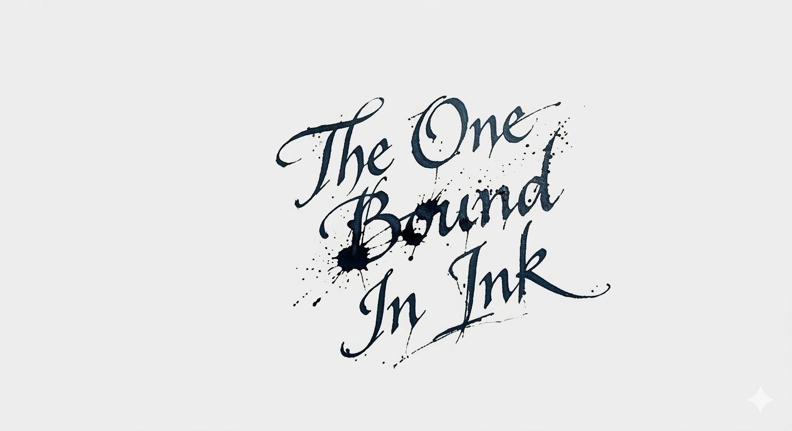



# FF14 Lovense Bridge 🎮

**Feel the game.** Real-time haptic feedback for Final Fantasy XIV using Lovense toys.

Every in-game action translates into vibration patterns — take damage, get healed, clear a dungeon, or get /kissed and *feel it* in real time.

## Quick Start

```bash
git clone https://github.com/SunFlash12/ff14-lovense.git
cd ff14-lovense
pip install requests
python ff14_lovense.py --setup    # First-time setup wizard
python ff14_lovense.py --demo     # Try without toys
python ff14_lovense.py --test     # Test your toys
python ff14_lovense.py            # Start playing!
```

## Features

### Combat Feedback
- **Damage taken** scales vibration with hit severity (combo system: repeated hits = stronger!)
- **HP tracking** -- lower HP = stronger continuous buzz
- **Tankbusters** -- max intensity burst
- **AOE warnings** -- pulsing alert pattern
- **Boss casts** -- building tension
- **Limit Break** -- FULL POWER on all toys
- **Death** -- one big buzz then silence
- **Victory** -- fireworks celebration preset!

### Social & Emotes
Each emote has a unique vibration pattern:
- `/hug` -- warm pulse
- `/kiss` -- building wave
- `/pet` -- gentle
- `/slap` -- sharp burst
- `/spank` -- burst + pulse
- `/dance` -- wave preset
- `/dote` -- sustained warmth

### ERP Support
Keyword detection with escalating intensity:
- Mild -> Intense -> Tease -> Rough -> Climax
- All toys activate on climax for maximum effect

### Technical
- **Webhook server** (port 8069) for Dalamud plugin integration
- **Network log parser** for ACT/IINACT combat data
- **Combo system** -- repeated events increase intensity
- **Multi-toy support** -- different toys respond to different events
- **Status endpoint** -- GET http://127.0.0.1:8069 for health check

## Setup Options

### Option 1: Dalamud + Triggernometry (Recommended)
1. Install [XIVLauncher](https://goatcorp.github.io/)
2. Install the **Triggernometry** plugin
3. Add triggers that POST JSON to `http://127.0.0.1:8069`

Example trigger payload:
```json
{"event": "damage_taken", "value": 15000, "max_hp": 50000}
```

### Option 2: ACT Network Logs (Automatic)
Just run the bridge with your player name:
```bash
python ff14_lovense.py --player "Firstname Lastname"
```
The bridge auto-detects ACT/IINACT log files and parses combat events.

## Supported Events

| Event | Trigger | Vibration Response |
|-------|---------|-------------------|
| `damage_taken` | Getting hit | Scales with damage % |
| `damage_dealt` | Your attacks | Satisfying feedback |
| `hp_update` | HP changes | Continuous intensity |
| `death` | You die | Max burst then stop |
| `raise` | Resurrected | Rising celebration |
| `heal_received` | Healing | Gentle waves |
| `limit_break` | LB activation | MAX POWER |
| `tankbuster` | Big single hit | Intense burst |
| `boss_cast` | Boss ability | Building tension |
| `aoe_warning` | Mechanic marker | Pulsing alert |
| `stack_marker` | Stack mechanic | Building to max |
| `enrage` | Boss enrage | ALL TOYS MAX |
| `duty_complete` | Clear duty | Fireworks! |
| `wipe` | Party wipe | Full stop |
| `emote` | Social emotes | Per-emote patterns |
| `chat_trigger` | ERP keywords | Escalating intensity |
| `zone_change` | Change zone | Quick haptic |
| `cutscene_start` | Cutscene | Ambient buzz |

## Configuration

### First-time Setup
```bash
python ff14_lovense.py --setup
```
The setup wizard will:
1. Find your Lovense toys on the network
2. Save configuration to `local_config.py` (gitignored)
3. Guide you through Dalamud plugin setup

### Manual Config
Create `local_config.py`:
```python
LOVENSE_DOMAIN = "https://YOUR-IP.lovense.club:30010"
TOYS = {
    "edge": "your-toy-id-here",
}
```

### Environment Variables
```bash
export LOVENSE_DOMAIN="https://YOUR-IP.lovense.club:30010"
```

## Requirements
- Python 3.8+
- `pip install requests`
- Lovense Remote app with Game Mode ON
- Same WiFi network as your phone
- FF14 (with XIVLauncher or ACT)

## Support the Project

If you enjoy this mod, consider buying me a coffee:

[Ko-fi - The One Bound In Ink](https://ko-fi.com/theoneboundinink)

## License
MIT -- use it, mod it, share it, feel it.

## Disclaimer
This is a third-party tool not affiliated with Square Enix, Final Fantasy XIV, or Lovense. Use at your own risk and discretion. Not responsible for any in-game deaths caused by... distraction. ;)

